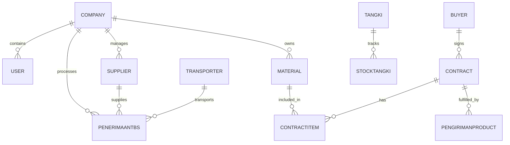

# Database Schema Reference: htgroupapp

Dokumen ini menjelaskan struktur data inti dan relasi antar entitas dalam database PostgreSQL menggunakan Prisma ORM.

## 🏢 Core Entities (Multi-Tenant)

Sistem ini didesain sebagai multi-tenant dimana hampir semua entitas merujuk ke `Company`.

| Model | Deskripsi | Relasi Utama |
|-------|-----------|--------------|
| `Company` | Entitas perusahaan induk (PT). | `User`, `Supplier`, `Material`, `PenerimaanTBS` |
| `User` | Pengguna sistem dengan peran tertentu. | `Company`, `Role`, `Notification` |
| `Role` | Definisi hak akses dalam format JSON. | `Company`, `User` |

## 🚜 Operasional PKS

### Penerimaan TBS (`PenerimaanTBS`)
Model sentral untuk pencatatan logistik masuk.
- **Relasi**:
    - `supplierId`: Merujuk ke `Supplier`.
    - `transporterId`: Merujuk ke `Transporter`.
    - `materialId`: Jenis material (TBS).
    - `vendorBongkarId`: Vendor upah bongkar (opsional).
- **Key Fields**: `nomorPenerimaan`, `beratBruto`, `beratTarra`, `beratNetto2`, `status`.

### Stock & Tangki
- `Material`: Katalog barang (Bahan Baku, Hasil Produksi, Sparepart).
- `StockMaterial`: Saldo stok real-time per perusahaan per material.
- `Tangki`: Lokasi fisik penyimpanan hasil produksi (CPO/Kernel).
- `StockTangki`: Histori mutasi stok di dalam tangki (`MASUK`, `KELUAR`, `TRANSFER`).

## 🤝 Sales & Logistics

### Buyer & Contract
- `Buyer`: Pihak pembeli produk hasil produksi.
- `Contract`: Komitmen penjualan jangka panjang atau pendek.
    - `ContractItem`: Detail item di dalam kontrak (Quantity & Price).
- `PengirimanProduct`: Realisasi pengiriman berdasarkan Kontrak/DO.

### Vendor & Transportasi
- `Vendor`: Perusahaan penyedia jasa (Logistik/Bongkar).
- `Transporter`: Armada angkutan individu/perusahaan.
- `VendorVehicle`: Detail kendaraan (Nopol) dan supir milik Vendor.

## 💰 Finance

- `Invoice`: Tagihan ke Buyer.
- `BiayaPengeluaran`: Pencatatan pengeluaran operasional.
- `PurchaseRequest` & `PurchaseOrder`: Alur pengadaan barang (Gudang).

---
## 🗺️ Entity Relationship (Simplified)

---
*Dibuat otomatis oleh Antigravity untuk dokumentasi internal.*
