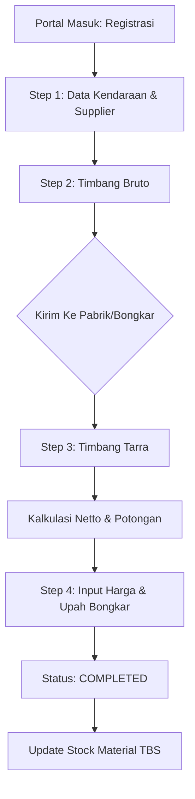
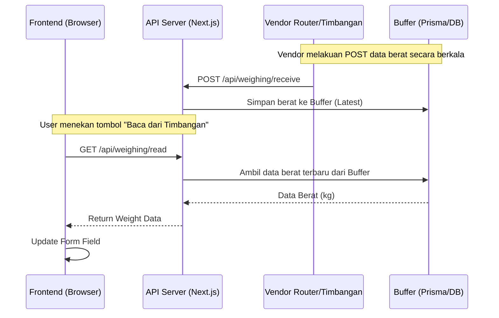
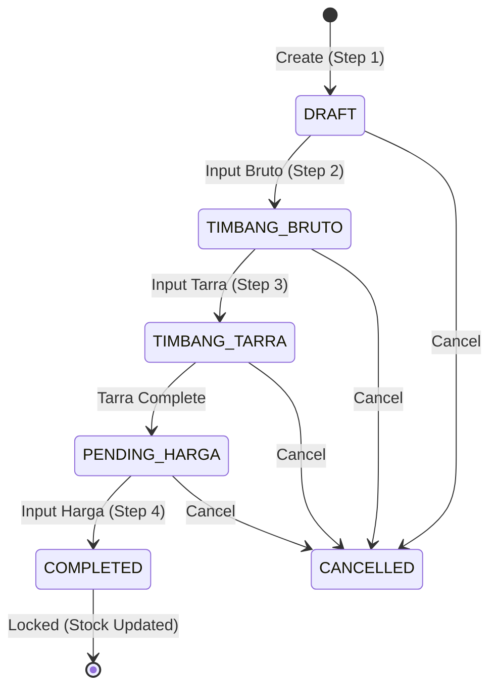

# Technical Flows & Sequences: htgroupapp

Dokumen ini menjelaskan alur teknis proses bisnis kritis dalam sistem **htgroupapp** menggunakan diagram Mermaid.

## 1. Alur Penerimaan TBS (Stage 1-4)
Proses dari pendaftaran kendaraan hingga penyelesaian transaksi dan update stok.



## 2. Sequence Diagram: Weighing Scale Integration
Bagaimana data diambil secara otomatis dari timbangan vendor.



## 3. Alur Produksi & Stok
Siklus pengolahan bahan baku menjadi produk jadi.

```mermaid
graph LR
    TBS[(Stok TBS)] --> Proc[Proses Produksi]
    Proc --> CPO[Hasil: CPO]
    Proc --> PK[Hasil: Kernel]
    Proc --> Shell[Hasil: Shell]
    
    CPO --> Tank[(Tangki Timbun)]
    PK --> Warehouse[(Gudang Kernel)]
    
    Note right of Proc: Kalkulasi Rendemen Otomatis
```

## 4. State Transition: Penerimaan TBS
Diagram ini menunjukkan perubahan status pada entitas `PenerimaanTBS` berdasarkan aksi user.



## 5. RBAC JSON Structure & Check Logic
Hak akses (permissions) disimpan di dalam model `Role` sebagai field `Json`.

### Struktur Izin (Permissions JSON)
Format yang digunakan memungkinkan kontrol per module dan per action.
```json
{
  "resources": {
    "tbs-penerimaan": ["read", "create", "update", "delete", "export"],
    "produksi": ["read", "process"],
    "finance-invoice": ["read", "create", "pay"],
    "settings-user": ["read", "write"]
  }
}
```

### Mekanisme Pengecekan (Logic)
- **Frontend**: Komponen `<PermissionGuard permission="tbs-penerimaan.create">` akan melakukan pengecekan terhadap array permissions dalam session user. Jika tidak memiliki izin, anak komponen tidak akan dirender.
- **Backend (API)**: Fungsi `checkPermission(session, "tbs-penerimaan", "create")` dijalankan di awal handler API untuk memastikan keamanan data di tingkat server.

---
*Dibuat otomatis oleh Antigravity untuk dokumentasi internal.*

