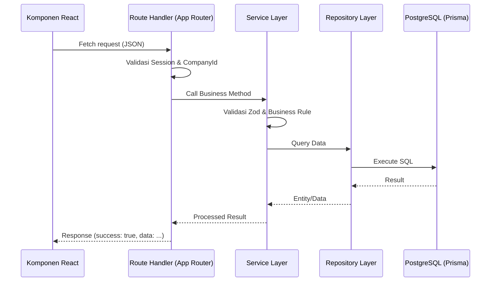

# Arsitektur Lengkap Sistem: htgroupapp

Dokumen ini menyajikan panduan arsitektur komprehensif bagi sistem **htgroupapp**, mencakup struktur folder, pola desain, keamanan, dan alur data antar modul.

---

## 🏗️ 1. High-Level Architecture

Sistem ini dibangun sebagai aplikasi **Full-stack Monolith** menggunakan **Next.js 15** dengan pendekatan **Multi-Tenant** (berbasis Perusahaan/Company).

### Core Strategy:
- **Tenant Isolation**: Data dipisahkan di level query menggunakan `companyId`.
- **Infrastructure**: Shared Database (PostgreSQL), Shared Application Server.
- **Client**: Web-based (Responsive) dengan optimasi untuk operasional pabrik.

---

## 📁 2. Struktur Folder & Modul (`src/`)

### 🌐 `src/app` (Routing & UI Pages)
Menggunakan **App Router** Next.js.
- `(protected-pages)`: Halaman dashboard yang memerlukan autentikasi. Struktur folder di dalamnya mengikuti kode perusahaan (misal: `/dashboard/pt-pks`).
- `api/`: Endpoint backend. Terorganisir per perusahaan (`api/pt-pks/...`) dan utilitas sistem (`api/weighing/...`).
- `auth/`: Halaman login dan manajemen sesi.

### 🧩 `src/components` (UI Building Blocks)
Mengikuti pola **Atomic Design** atau **Shadcn UI components**.
- `/ui`: Komponen dasar yang *stateless* (Button, Input, Dialog, dll).
- `/auth`: Komponen khusus terkait autentikasi (LoginForm).
- `*`: Komponen fungsional spesifik per modul.

### ⚙️ `src/server` (Backend logic Layer)
Layer paling krusial yang menangani transaksi data berat.
- `repositories/`: Akses database langsung via Prisma. Satu file per entitas/tabel.
- `services/`: Logika bisnis. Mengorkestrasi repository, validasi data, dan *complex state changes*.
- `schema/`: Definisi skema validasi **Zod** untuk input API dan form.
- `db.ts`: Inisialisasi klien Prisma.

### 🪝 `src/hooks` (Logic Extraction)
Custom hooks untuk memisahkan logika dari komponen UI.
- `use-weighing-scale.ts`: Logika integrasi timbangan (fetching data dari buffer).
- `use-user-permissions.ts`: Mengecek izin akses (RBAC) user secara reaktif.

### 🛠️ `src/lib` (Utilities & Core helpers)
- `rate-limiter.ts`: Pencegahan spamming API.
- `rbac.ts`: Evaluasi permission JSON untuk keamanan server-side.
- `utils.ts`: Fungsi pembantu umum (format mata uang, tanggal, dll).

---

## 🔧 3. Konfigurasi & Keamanan Inti

### 🔑 Environment Management (`src/env.js`)
Menggunakan `@t3-oss/env-nextjs` untuk memastikan semua variabel lingkungan (`.env`) tervalidasi saat *build* dan *runtime*.
- Mendefinisikan `DATABASE_URL`, `AUTH_SECRET`, dan variabel lingkungan lainnya dengan skema Zod.

### 🛡️ Middleware & Routing Control (`src/middleware.ts`)
Mengatur aksesibilitas rute di tingkat ujung (Edge).
- **Authentication Check**: Memvalidasi JWT token via NextAuth.
- **Tenant Guard**: Memastikan user PT-A tidak bisa membuka dashboard PT-B.
- **Rate Limiting**: Membatasi request pada endpoint sensitif (statistik, stok).
- **Public vs Protected**: Memisahkan rute publik (Login) dan privat.

---

## ⚖️ 4. Data Flow & Patterns

### 1. Pola Request-Response API

### 2. Integrasi Timbangan (Weighing Scale)
Menerapkan pola **Buffer-Fetch** untuk mengatasi perbedaan kecepatan akses hardware dan UI.
- Hardware vendor mendorong data ke `/api/weighing/receive`.
- Data disimpan di database buffer (`PenerimaanTBS` atau tabel log khusus).
- UI frontend menarik data tersebut saat tombol "Baca" ditekan (`/api/weighing/read`).

---

## 🎨 5. Styling & Visuals (`src/styles`)
- **Tailwind CSS**: Utility-first CSS untuk desain yang konsisten.
- **Global Themes**: Konfigurasi variabel warna dan font untuk HT Group.
- **Animations**: Menggunakan `framer-motion` untuk micro-interactions yang premium.

---
*Dibuat otomatis oleh Antigravity untuk dokumentasi arsitektur internal.*
